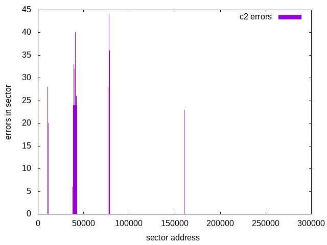

# Command-line interface

## Make a graph of C2 read errors from a CD/DVD

### Requirements

* Linux machine with a CD/DVD/BluRay device. Raspberry Pi and a USB-to-IDE or USB-to-SATA plus external drive is fine.
* CD/DVD/BluRay disk
* Dependencies: `readom`, `make`, `sed`, and `gnuplot`

For a Debian-based OS (including Ubuntu and Raspberry OS), 
package `wodim` provides `readom` command. You can install 
these with:
```bash
sudo apt-get update ; sudo apt-get install wodim make sed gnuplot-nox
```

For Arch Linux, `readom` is present under `cdrtools` package. 
So, use this instead:
```bash
sudo pacman -Sy cdrtools make sed gnuplot
```

### Get data

* Put a CD in the drive.
* Run command

<pre>
time readom -noerror -nocorr -c2scan dev=/dev/cdrom 2>&1 | tee some_file_name.log
</pre>

* This will produce a `some_file_name.log` file.

### Get graphs

* Run `make` to process the data.
* This will produce `some_file_name.dat` `some_file_name.png` and `some_file_name.pdf`.
* `some_file_name.dat` is the data that is used to produce the graph: first column sector number, second column number of errors in the sector.

Here is an example graph.  See `doc` directory for data and generated files.


